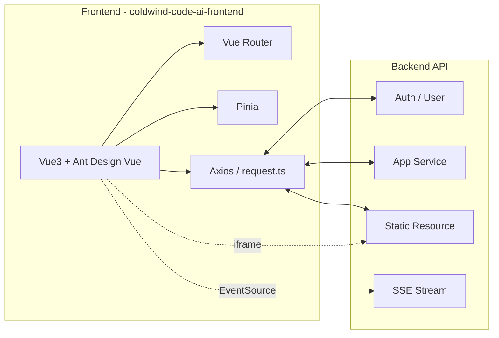
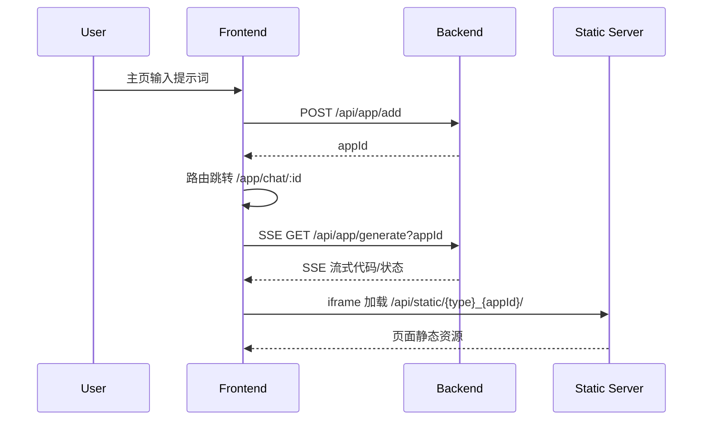
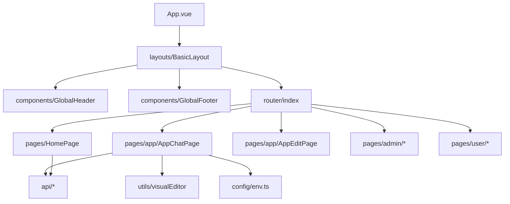
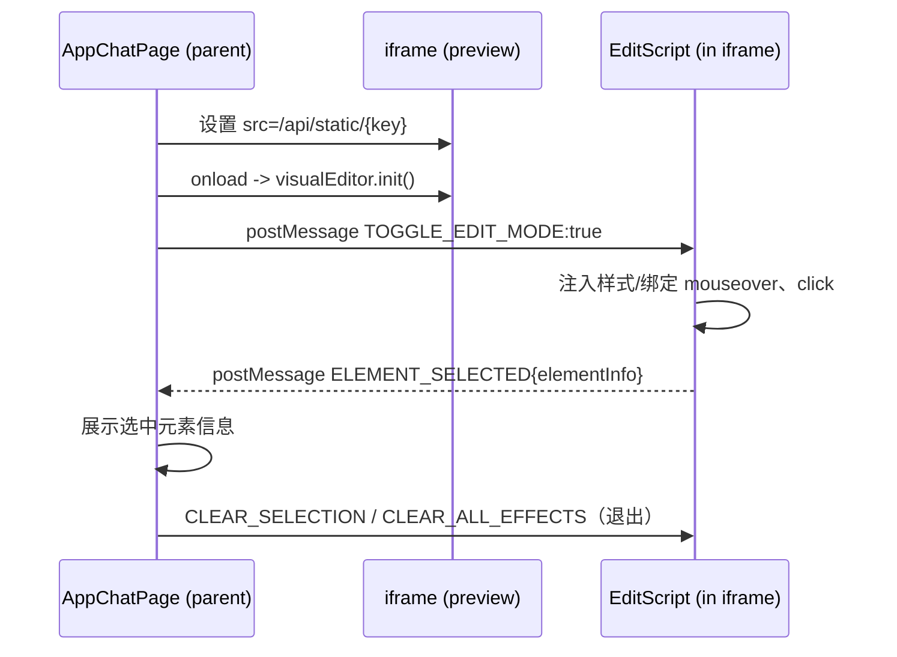
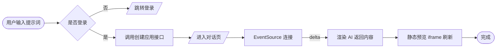
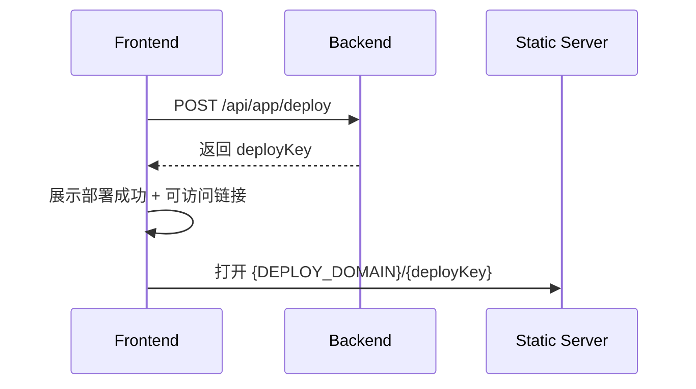

# No Code AI应用生成平台 - 前端（coldwind-code-ai-frontend）

一句话，生成你想要的网站。

基于 Vue 3 + TypeScript + Ant Design Vue 的前端项目。通过与 AI 对话创建网站应用，实时预览、部署与管理。

## 功能特性

### 用户功能

- 🚀 **应用创建**：输入用户提示词来创建应用
- 💬 **AI 对话**：通过和 AI 对话生成网站应用，并实时查看效果
- 📝 **应用管理**：修改自己的应用信息（应用名称）
- 🗑️ **应用删除**：删除自己的应用
- 👀 **应用查看**：查看应用详情和生成效果
- 🚀 **应用部署**：部署应用到云端
- 📋 **应用列表**：分页查询自己的应用列表（支持根据名称查询）
- ⭐ **精选应用**：分页查询精选的应用列表

### 管理员功能

- 🔧 **应用管理**：删除任意应用
- ✏️ **应用编辑**：更新任意应用信息（应用名称、应用封面、优先级）
- 📊 **应用查询**：分页查询应用列表（支持多字段查询）
- 👁️ **应用查看**：查看任意应用详情
- ⭐ **精选设置**：设置应用为精选（优先级99）

## 页面结构

### 1. 主页 (`/`)

- 网站标题和描述
- 用户提示词输入框
- 快捷操作按钮
- 我的应用分页列表
- 精选应用分页列表

### 2. 应用生成对话页 (`/app/chat/:id`)

- 顶部栏：应用名称 + 部署按钮
- 左侧对话区域：消息展示 + 用户输入框
- 右侧网页展示区域：实时预览生成的网站
- 部署成功弹窗

### 3. 应用管理页 (`/admin/appManage`)

- 仅管理员可见
- 搜索表单：应用名称、创建者、生成类型
- 应用列表表格：支持编辑、删除、精选操作

### 4. 应用信息修改页 (`/app/edit/:id`)

- 用户和管理员都可进入
- 普通用户只能编辑应用名称
- 管理员可编辑应用名称、封面、优先级
- 应用详细信息展示

## 技术栈

- **前端框架**：Vue 3 + TypeScript
- **UI 组件库**：Ant Design Vue
- **路由管理**：Vue Router 4
- **状态管理**：Pinia
- **构建工具**：Vite
- **HTTP 客户端**：Axios
- **时间处理**：Day.js（如有使用）
- **代码规范**：ESLint + Prettier

## 项目结构

```
src/
├── api/                    # API 接口定义
│   ├── appController.ts    # 应用相关接口
│   ├── userController.ts   # 用户相关接口
│   └── typings.d.ts        # 类型定义
├── components/             # 公共组件
│   ├── GlobalHeader.vue    # 全局头部
│   └── GlobalFooter.vue    # 全局底部
├── layouts/                # 布局组件
│   └── BasicLayout.vue     # 基础布局
├── pages/                  # 页面组件
│   ├── HomePage.vue        # 首页
│   ├── app/                # 应用相关页面
│   │   ├── AppChatPage.vue # 应用对话页
│   │   └── AppEditPage.vue # 应用编辑页
│   ├── admin/              # 管理员页面
│   │   ├── AppManagePage.vue # 应用管理页
│   │   └── UserManagePage.vue # 用户管理页
│   └── user/               # 用户页面
│       ├── UserLoginPage.vue
│       └── UserRegisterPage.vue
├── stores/                 # 状态管理
│   └── loginUser.ts        # 登录用户状态
├── utils/                  # 工具函数
│   ├── constants.ts        # 常量定义
│   ├── format.ts          # 格式化工具
│   └── validation.ts      # 验证工具
├── router/                 # 路由配置
│   └── index.ts
└── main.ts                # 应用入口
```

## 开发与运行

### 推荐 IDE

[VSCode](https://code.visualstudio.com/) + [Volar](https://marketplace.visualstudio.com/items?itemName=Vue.volar)（需禁用 Vetur）

### 安装依赖

```sh
npm install
```

### 本地启动

```sh
npm run dev
```

### 构建（类型检查 + 打包）

```sh
npm run build
```

### 代码检查

```sh
npm run lint
```

## 使用说明

### 编辑模式（可视化选中元素）
- 在应用对话页右上角点击“编辑模式”进入
- 鼠标悬浮高亮、点击选中元素，元素信息会显示在对话上方
- 发送消息时会自动带上选中元素上下文，便于 AI 精准修改

### 1. 创建应用流程

1. 用户在主页输入提示词
2. 调用创建应用接口得到应用 ID
3. 跳转到对话页面
4. 自动发送初始提示词给 AI
5. 通过 SSE 实时显示 AI 回复
6. 生成完成后在右侧展示网站效果

### 2. 部署应用流程

1. 在对话页面点击部署按钮
2. 调用后端部署接口
3. 获取可访问的 URL 地址
4. 显示部署成功弹窗

### 3. 管理应用流程

1. 管理员进入应用管理页
2. 查看应用列表，支持搜索过滤
3. 可以编辑、删除、设置精选
4. 编辑跳转到应用编辑页面

## 架构图（Mermaid）

### 整体系统架构



### 前后端交互（主要页面）



### 前端模块结构



### 编辑模式脚本注入与消息流



### 生成流程（SSE）



### 部署与静态预览



## 注意事项

- 应用生成需要后端 AI 服务支持
- 部署功能需要配置部署服务
- 管理员功能需要相应的权限控制
- 预览功能依赖后端静态资源服务；若无法编辑，请检查是否跨域或资源路径错误

## 环境变量
在根目录 `.env.development` 可配置：

```
VITE_DEPLOY_DOMAIN=http://localhost
VITE_API_BASE_URL=http://localhost:8999/api
```

预览跨域修复：`src/config/env.ts` 中 `getStaticPreviewUrl` 返回 `/api/static/...` 相对路径，经由 `vite.config.ts` 的代理对接后端。

## 贡献指南

1. Fork 本仓库
2. 创建特性分支 (`git checkout -b feature/AmazingFeature`)
3. 提交更改 (`git commit -m 'Add some AmazingFeature'`)
4. 推送到分支 (`git push origin feature/AmazingFeature`)
5. 打开 Pull Request

## 许可证

本项目采用 MIT 许可证 - 查看 [LICENSE](LICENSE) 文件了解详情
